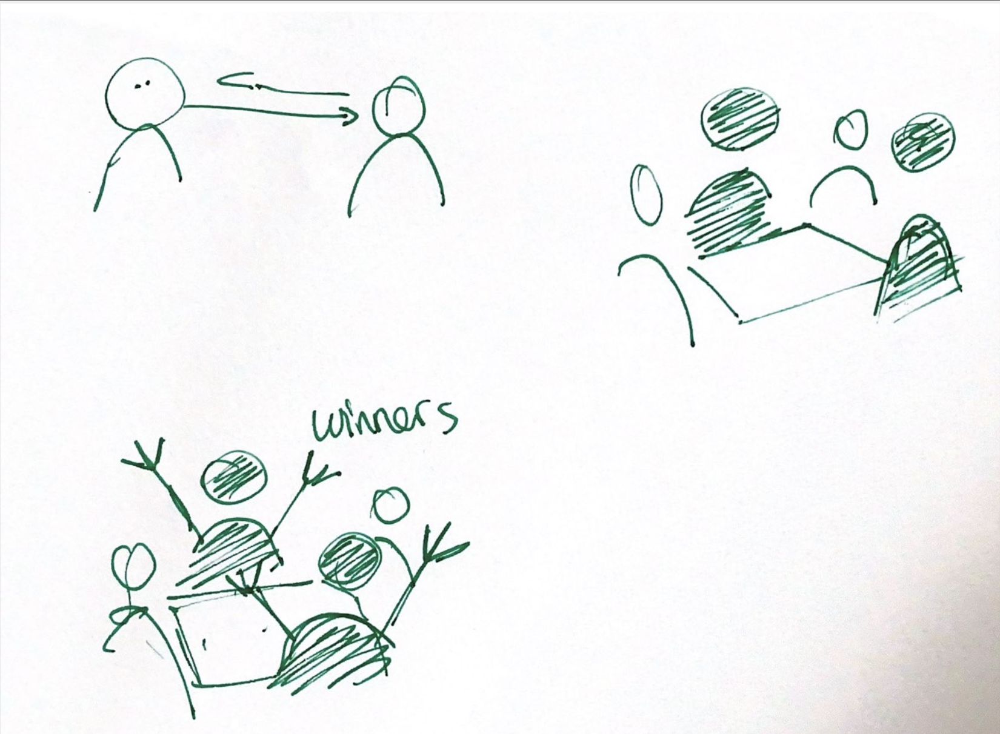

# Zainab Ouriachi

## Research 
I am researching how cheating in card games creates secret systems of communication that reveal trust, complicity, and the limits of skill.

- **Cheating as hidden communication :** Small gestures, looks, or signals can replace words, forming a secret code between players.
- [hidden communication](https://youtu.be/E33jLqBWHmk)

- **Risk and complicity in pairs:** Cheating in a binome can create trust but also backfire if one partner fails.

[two players coordinating gestures](https://youtu.be/3Ig571vHPUg)
- **Skill vs. accessibility :** Some forms of cheating, like false shuffling, demand high expertise, making them harder to master.

[failed shuffle attempt](https://youtu.be/E33jLqBWHmk)

- **Adaptability of methods :** Not all games allow the same tricks; strategies shift depending on the rules and number of players.

- **Picking as a universal gesture :** Simple, discreet signals like “picking” are easier to learn and can work alone or in pairs.
- 

## Cheating
Cheating in card games isn’t just breaking rules it’s about secret communication. Small gestures, silent trust, and quick alliances reveal our need for connection, risk, and complicity. Hidden codes turn the game into a mirror of how we build bonds and test trust in everyday life.

## Keyword
Cheat 

## User Journey
- 

## Novel Combinations
- gesture
- code
- cheat 